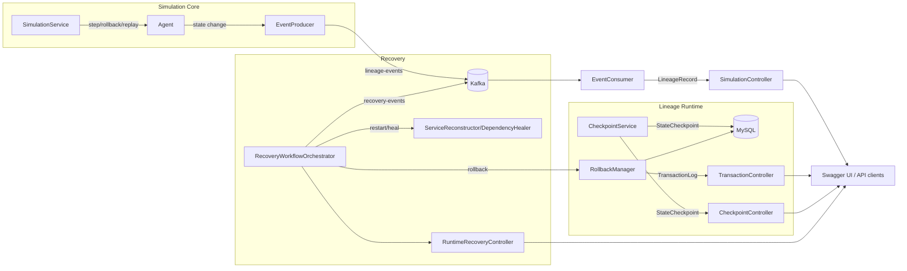

# Architecture

Lineage-Sim is a layered Spring Boot service that couples a digital-life simulation core with a lineage runtime and an autonomous recovery engine. Every state transition is persisted, replayable, and observable through the public API.

## System Context

- **Simulation Core** evolves autonomous agents and emits lineage events for every `step()`.
- **Lineage Runtime** captures checkpoints, manages saga-style transactions, and persists snapshots in MySQL.
- **Kafka** streams (`lineage-events`, `recovery-events`, `rollback-events`) provide an immutable audit trail that powers replays, dashboards, and recovery coordination.
- **Autonomous Recovery** orchestrates detect → isolate → rollback → recover → validate workflows when a service degrades.
- **API Layer** exposes simulation, checkpoint, transaction, and recovery endpoints with OpenAPI 3.1 documentation and shared error envelopes.

## High-Level Topology

## Component Breakdown

### Simulation Core (`prototype.simulationcore`)

- `SimulationService`, `RollbackService`, and `ReplayService` mutate/restore agents.
- Agents carry policies (`AgentPolicy`, `NeuralPolicy`, etc.) and state snapshots (`AgentState`, `Position`).
- `EventConsumer` projects Kafka lineage events into lightweight `LineageRecord` DTOs consumed by the public API.

### Lineage Runtime (`prototype.lineageruntime`)

- **Checkpointing** – `CheckpointService` captures snapshots via `ServiceStateAdapter` implementations, repo-backed by `StateCheckpointRepository`.
- **Transactions** – `RollbackManager` records saga steps/compensating actions using `TransactionLogRepository`.
- **Resilience** – Circuit breakers, rollback coordinators, and Kafka producers handle fault isolation and event fan-out.

### Autonomous Recovery (`prototype.lineageruntime.recovery`)

- `RecoveryWorkflowOrchestrator` executes detect → isolate → rollback → recover → validate loops.
- `DependencyHealer`, `ServiceReconstructor`, `FailoverManager`, and `ServiceTopology` manage dependencies, fallbacks, and health verification.
- Recovery emits both `RecoveryWorkflowEvent` and `RollbackEvent` messages for observability.

### API & Documentation Layer (`prototype.api`)

- Controllers (`SimulationController`, `TransactionController`, `CheckpointController`, `RuntimeRecoveryController`) expose REST endpoints annotated with OpenAPI metadata, request/response examples, and shared error schemas.
- `ApiError`, `ErrorCode`, and `ApiException` enforce a consistent error contract with trace IDs.
- `OpenApiConfig` seeds title/description/contact metadata, while `springdoc-openapi` serves `/v3/api-docs` and `/swagger-ui.html`.

## Data & Event Flow

1. `POST /simulate/step` advances the agent, which emits a lineage event via Kafka and returns an `AgentDto`.
2. Operators capture service state via `POST /runtime/checkpoint/{serviceId}`; snapshots land in MySQL and can be restored later.
3. Distributed transactions call into `RollbackManager` (`/api/transactions`) to ensure compensating actions exist for every operation.
4. If a service degrades, `POST /runtime/recover/{serviceId}` orchestrates isolation, rollback, redeploy, validation, and emits workflow events.
5. `GET /simulate/history` reads the projected lineage buffer for audits or dashboards.

## Persistence & Messaging

- **MySQL** stores `StateCheckpoint` and `TransactionLog` entities. JPA manages schema via `ddl-auto=update`.
- **Kafka** topics:
  - `lineage-events` – immutable agent state transitions.
  - `recovery-events` – each workflow step outcome.
  - `rollback-events` – before/after snapshots whenever rollback actions execute.
- **Configuration** lives in `application.yml`, including DB/Kafka credentials, retention policies, and recovery backoff parameters.

## Error Handling & Observability

- All controllers throw `ApiException` with a specific `ErrorCode` (`TRX-404`, `SIM-500`, `RCV-500`, etc.).
- `GlobalExceptionHandler` converts exceptions into `ApiError` responses, attaches a `traceId`, and logs errors with structured context.
- Swagger UI renders embedded request/response examples to aid consumers; OpenAPI metadata is also exported for automation.

## Future Enhancements

- Harden security (OAuth2 / mTLS) for production deployments.
- Expand agent policy surface (reinforcement learning, multi-agent coordination).
- Persist lineage projections in an analytical store for long-horizon queries.
- Add Grafana dashboards sourced from the Kafka topics and `ApiError` trace IDs.

For operational steps and API-level details, see `DEPLOYMENT.md` and `API-REFERENCE.md`.

